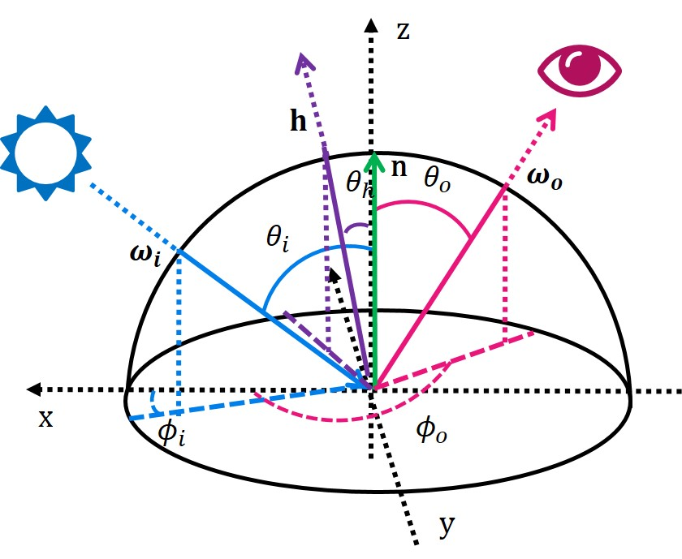

# Awesome-BRDF
List of awesome papers on BRDF

## Table of contents

- [BRDF Representation](#brdf-representation)

## BRDF Representation

|Year|Pub|Name|Paper|Reciprocity|Energy Cons.|
|:---:|:---:|:---:|:---:|:---:|:---:|
|1720|Eberhard Klett|Lambert|[Photometria sive de mensura et gradibus luminis, colorum et umbrae](https://archive.org/details/lambertsphotome00lambgoog/page/n6/mode/2up)|||
|1975|CACM|Phong|[Illumination for computer generated pictures](https://dl.acm.org/doi/10.1145/360825.360839)|||
|1977|SIGGRAPH|Blinn-Phong|[Models of light reflection for computer synthesized pictures](https://dl.acm.org/doi/10.1145/965141.563893)|||
|1982|TOG|Cook-Torrance|[A Reflectance Model for Computer Graphics](https://dl.acm.org/doi/10.1145/357290.357293)||&#10003;||
|1991|SIGGRAPH|He|[A comprehensive physical model for light reflection](https://dl.acm.org/doi/10.1145/127719.122738)|&#10003;|&#10003;|
|1992|SIGGRAPH|Ward|[Measuring and modeling anisotropic reflection](https://dl.acm.org/doi/10.1145/142920.134078)|&#10003;||
|1994|SIGGRAPH|Oren-Nayar|[Generalization of Lambert's reflectance model](https://dl.acm.org/doi/10.1145/192161.192213)|&#10003;|&#10003;|
|1997|SIGGRAPH|Lafortune|[Non-Linear Approximation of Reflectance Functions](http://www.lafortune.eu/publications/Siggraph.html)|&#10003;|&#10003;|
|1999|CGF|Neumann|[Compact Metallic Reflectance Models](http://citeseer.ist.psu.edu/viewdoc/download;jsessionid=3D3407B845B0B7F0314B4D2694501DEE?doi=10.1.1.41.3489&rep=rep1&type=pdf)|&#10003;|&#10003;|
|2000|JGT|Ashikhmin-Shirley|[An anisotropic phong BRDF model](http://citeseerx.ist.psu.edu/viewdoc/download?doi=10.1.1.18.4558&rep=rep1&type=pdf)|||
|2001|CGF|Ershov|[Rendering pearlescent appearance based on paint-composition modelling](https://domino.mpi-inf.mpg.de/intranet/ag4/ag4publ.nsf/93832a04987390a3c12567530068622d/9bfb2b24db8e17bbc1256a7d004f1487/$FILE/EG01Paint.pdf)||&#10003;|
|2006|TOG|Edwards|[The halfway vector disk for brdf modeling](https://graphics.stanford.edu/~boulos/papers/brdftog.pdf)||&#10003;|
|2007|-|Ashikhmin-Premoze|[Distribution-based brdfs](https://citeseerx.ist.psu.edu/viewdoc/download?doi=10.1.1.621.5638&rep=rep1&type=pdf)|&#10003;|&#10003;|
|2007|EGSR|Walter(GGX)|[Microfacet Models for Refraction through Rough Surfaces](https://www.cs.cornell.edu/~srm/publications/EGSR07-btdf.html)|&#10003;|&#10003;|
|2008|GRAPHITE|Weidlich and Wilkie|[Arbitrarily Layered Micro-Facet Surfaces](https://www.cg.tuwien.ac.at/research/publications/2007/weidlich_2007_almfs/weidlich_2007_almfs-paper.pdf)|&#10003;|&#10003;|
|2010|SIGGRAPH|Kurt|[An anisotropic brdf model for fitting and monte carlo rendering](http://akademik.ube.ege.edu.tr/~kurt/Publications/SIGGRAPH_Computer_Graphics_2010_Kurt.pdf)|&#10003;|&#10003;|
|2012|CGF|Bagher|[Accurate fitting of measured reflectances using a Shifted Gamma micro-facet distribution](https://hal.inria.fr/hal-00702304/document)|&#10003;||
|2012|TOG|L&omacr;w|[Brdf models for accurate and efficient rendering of glossy surfaces](https://dl.acm.org/doi/10.1145/2077341.2077350)|&#10003;||
|2014|TOG|Brady|[genBRDF: discovering new analytic BRDFs with genetic programming](https://dl.acm.org/doi/10.1145/2601097.2601193)|&#10003;||
|2014|TOG|Jakob|[Discrete stochastic microfacet models](https://dl.acm.org/doi/10.1145/2601097.2601186)|||

### Fresnel Term

<table>
  <thead>
  <tr>
    <th>Name</th>
    <th>Year</th>
    <th>Pub</th>
    <th>Paper</th>
    <th>Reciprocity</th>
    <th>Energy Cons.</th>
  </tr>
  </thead>
  <tbody>
  <tr>
    <td rowspan="2">Lambert</td>
    <td>1720</td>
    <td>Eberhard Klett</td>
    <td><a href= "https://archive.org/details/lambertsphotome00lambgoog/page/n6/mode/2up">Photometria sive de mensura et gradibus luminis, colorum et umbrae</a></td>
    <td></td>
    <td></td>
  </tr>
  <tr>
    <td colspan='5'></td>
  </tr>
  <tr>
    <td rowspan="2">Phong</td>
    <td>1975</td>
    <td>CACM</td>
    <td>
    <a href="https://dl.acm.org/doi/10.1145/360825.360839">Illumination for computer generated pictures</a>
    </td>
    <td></td>
    <td></td>
  </tr>
  <tr>
  <td colspan='5'></td>
  </tr>
  <tr>
    <td rowspan="2">Blinn-Phong</td>
    <td>1977</td>
    <td>SIGGRAPH</td>
    <td>
    <a href="https://dl.acm.org/doi/10.1145/965141.563893">Models of light reflection for computer synthesized pictures</a>
    </td>
    <td></td>
    <td></td>
  </tr>
  <tr>
  <td colspan='5'></td>
  </tr>
  <tr>
    <td rowspan="2">Cook-Torrance</td>
    <td>1977</td>
    <td>SIGGRAPH</td>
    <td>
    <a href="https://dl.acm.org/doi/10.1145/357290.357293">A Reflectance Model for Computer Graphics</a>
    </td>
    <td align="center">&#10003;</td>
    <td></td>
  </tr>
  <tr>
  <td colspan='5'>

    </td>
  </tr>
  <tr>
    <td rowspan="2">He</td>
    <td>1991</td>
    <td>SIGGRAPH</td>
    <td>
    <a href="https://dl.acm.org/doi/10.1145/127719.122738">A comprehensive physical model for light reflection</a>
    </td>
    <td align="center">&#10003;</td>
    <td align="center">&#10003;</td>
  </tr>
  <tr>
  <td colspan='5'>
  </td>
  </tr>        
  <tr>
    <td rowspan="2">Ward</td>
    <td>1992</td>
    <td>SIGGRAPH</td>
    <td>
    <a href="https://dl.acm.org/doi/10.1145/142920.134078">Measuring and modeling anisotropic reflection</a>
    </td>
    <td align="center">&#10003;</td>
    <td align="center"></td>
  </tr>
  <tr>
  <td colspan='5'>
    
    
  </td>
  </tr>        
  <tr>
    <td rowspan="2">Oren-Nayar</td>
    <td>1994</td>
    <td>SIGGRAPH</td>
    <td>
    <a href="https://dl.acm.org/doi/10.1145/192161.192213">Generalization of Lambert's reflectance model</a>
    </td>
    <td align="center">&#10003;</td>
    <td align="center">&#10003;</td>
  </tr>
  <tr>
  <td colspan='5'>
    
  </td>
  </tr>
  <tr>
    <td rowspan="2">Lafortune</td>
    <td>1997</td>
    <td>SIGGRAPH</td>
    <td>
    <a href="http://www.lafortune.eu/publications/Siggraph.html">Non-Linear Approximation of Reflectance Functions</a>
    </td>
    <td align="center">&#10003;</td>
    <td align="center">&#10003;</td>
  </tr>
  <tr>
  <td colspan='5'>
  </td>
  </tr>
  <tr>
    <td rowspan="2">Neumann</td>
    <td>1999</td>
    <td>CGF</td>
    <td>
    <a href="http://citeseer.ist.psu.edu/viewdoc/download;jsessionid=3D3407B845B0B7F0314B4D2694501DEE?doi=10.1.1.41.3489&rep=rep1&type=pdf">Compact Metallic Reflectance Models</a>
    </td>
    <td align="center">&#10003;</td>
    <td align="center">&#10003;</td>
  </tr>
  <tr>
  <td colspan='5'>
  </td>
  </tr>
  <tr>
    <td rowspan="2">Ashikhmin-Shirley</td>
    <td>2000</td>
    <td>JGT</td>
    <td>
    <a href="http://citeseerx.ist.psu.edu/viewdoc/download?doi=10.1.1.18.4558&rep=rep1&type=pdf">An anisotropic phong BRDF model</a>
    </td>
    <td align="center"></td>
    <td align="center"></td>
  </tr>
  <tr>
  <td colspan='5'>
  </td>
  </tr>
  <tr>
    <td></td>
    <td></td>
    <td></td>
    <td></td>
    <td></td>
    <td></td>
  </tr>

</tbody>
</table>
